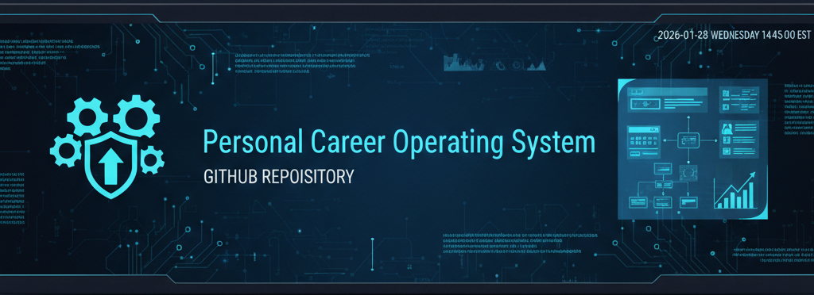
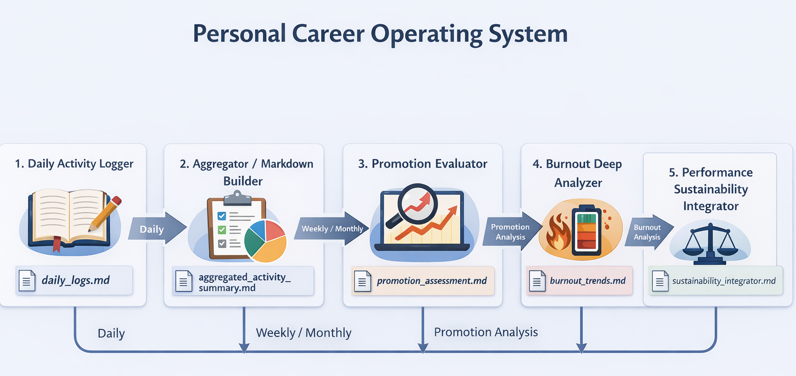

# Personal Career Operating System

<!-- SEO Keywords -->
<!-- Career Development, Engineering Career, Burnout Prevention, Personal Knowledge Management, AI Productivity, ATS Optimization, Career Operating System -->

<!-- Badge Suite -->

---

# 🧭 Two‑Column Overview

<table>
<tr>
<td width="50%" valign="top">

## **What This System Does**

The Personal Career Operating System transforms daily work activity into long‑term, evidence‑based career intelligence.  
It unifies:

- Daily performance logging  
- Weekly/monthly aggregation  
- Promotion readiness evaluation  
- Burnout analysis  
- Sustainability forecasting  
- Master skills & experience synthesis  
- Performance review content generation  

All engines output structured markdown files for version control, auditability, and AI‑assisted analysis.

</td>
<td width="50%" valign="top">

## **Core Benefits**

- Longitudinal visibility into your career  
- Governance‑grade documentation  
- Resume‑ready bullet generation  
- Early burnout detection  
- Strategic 3–6 month projections  
- ATS‑friendly skills & experience synthesis  
- High‑quality performance review content  
- A unified model for sustainable high performance  

</td>
</tr>
</table>

---

# 🧠 System Architecture

The system flows from **daily activity** → **aggregation** → **promotion evaluation** →  
**burnout analysis** → **sustainability integration** → **master skills synthesis** → **performance review generation**.

---

# ⚙️ Engine Breakdown

## **Engine 1 — Daily Activity Logger**
Captures timestamped, append‑only daily work activity.  
**Output:** `daily_logs.md`  
**Note:** Updated to include awareness of personal, sensitive, and proprietary data.

## **Engine 2 — Aggregator / Markdown Builder**
Rolls up logs into structured weekly/monthly summaries.  
**Output:** `aggregated_activity_summary.md`

## **Engine 3 — Promotion Evaluator**
Assesses readiness against role expectations and market standards.  
**Output:** `promotion_assessment.md`

## **Engine 4 — Burnout Deep Analyzer**
Identifies workload imbalance, stress patterns, and sustainability risks.  
**Output:** `burnout_trends.md`

## **Engine 5 — Performance Sustainability Integrator**
Merges promotion readiness + burnout risk into a unified trajectory model.  
**Output:** `sustainability_integrator.md`

## **Engine 6 — PCOS Master Skills & Experience Synthesizer**
Aggregates structured outputs from all engines to produce a polished, ATS‑friendly  
**Master Skills & Experience Summary**.

**Output:** `master_skills_experience_summary.md`  
**Source File:** `PCOS Master Skills & Experience Synthesizer.md`

---

# 🧩 Performance Review Generator (New)

This standalone prompt assists with generating **high‑quality performance review content** using structured data from the PCOS engines.

**Source File:** `Performance Review Generator Prompt.md`  
**Purpose:**  
- Converts aggregated accomplishments into review‑ready narratives  
- Supports self‑reviews, manager reviews, and 360‑style summaries  
- Ensures clarity, professionalism, and evidence‑based framing  

---

# 🗂️ File Maintenance & Structure Validator

The validator ensures all markdown files remain:

- Structurally consistent  
- Metadata‑complete  
- Properly formatted  
- Ready for downstream analysis  

It supports:

- `daily_logs.md`  
- `aggregated_activity_summary.md`  
- `promotion_assessment.md`  
- `burnout_trends.md`  
- `sustainability_integrator.md`  
- `master_skills_experience_summary.md`

See **Career File Maintenance & Structure Validator.md** for full validator usage instructions.

---

# 📁 Repository Contents

| File | Description |
|------|-------------|
| **BANNER_Personal-Career-Operating-System.png** | Repo banner |
| **Personal Career Operating System Workflow.png** | System workflow diagram |
| **Career_Operating_System_Executive_Guide.pdf** | Full executive guide |
| **Career Operating System.docx** | Editable guide |
| **Daily Performance Intake & Structuring Prompts.md** | Engine 1 prompts (updated for sensitive/proprietary data awareness) |
| **Performance Aggregator & Trend Analysis Prompts.md** | Engine 2 & 4 prompts |
| **Promotion & Market Readiness Evaluator.md** | Engine 3 prompts |
| **Burnout Deep Analyzer.md** | Engine 4 prompts |
| **Performance Sustainability Integrator.md** | Engine 5 prompts |
| **PCOS Master Skills & Experience Synthesizer.md** | Engine 6 prompts (ATS‑friendly synthesis) |
| **Performance Review Generator Prompt.md** | Generates structured, review‑ready performance content |
| **Career File Maintenance & Structure Validator.md** | Validator documentation |
| **Personal Career Operating System Workflow.pdf** | Printable workflow |
| **LICENSE** | License |
| **README.md** | This file |

---

# 🚀 Quick‑Start

1. Log daily activity → `daily_logs.md`  
2. Aggregate weekly/monthly → `aggregated_activity_summary.md`  
3. Evaluate promotion readiness → `promotion_assessment.md`  
4. Analyze burnout trends → `burnout_trends.md`  
5. Integrate everything → `sustainability_integrator.md`  
6. Generate ATS‑ready skills summary → `master_skills_experience_summary.md`  
7. Generate performance review content → `Performance Review Generator Prompt.md`  
8. Validate structure → run the validator  

**All prompts are in plain Markdown — no apps or subscriptions required.**

---

# 🔗 Cross‑Repo Ecosystem Links

### **💼 Career & Professional Development**
- **Job-Search-Career-Prompts** – Resume, interview, and career documentation suite  
  https://github.com/scottmalin68-commits/Job-Search-Career-Prompts

- **Personal-Career-Operating-System** *(this repo)*  
  https://github.com/scottmalin68-commits/Personal-Career-Operating-System

### **🛡️ Cybersecurity & Technical Learning**
- **Cybersecurity-Learning-Prompts** – Workshops, adversarial reasoning, cognitive load mapping  
  https://github.com/scottmalin68-commits/Cybersecurity-Learning-Prompts

### **⏱️ Productivity & Systems Design**
- **Time-and-Project-Management** – Planning, scheduling, and execution frameworks  
  https://github.com/scottmalin68-commits/Time-and-Project-Management

### **🧰 General AI Prompting & Utilities**
- **Misc-AI-Prompts** – Tools, utilities, and general-purpose AI prompts  
  https://github.com/scottmalin68-commits/Misc-AI-Prompts

---

# 🧩 Design Principles

- Lightweight  
- AI‑compatible  
- Governance‑grade  
- Sustainable  
- Traceable  
- Repeatable  
- ATS‑friendly  
- Review‑ready  

---

# 📦 Use Cases

The Personal Career Operating System supports a wide range of professional workflows:

### **📈 Promotion Packets**
- Evidence‑based accomplishments  
- Capability growth tracking  
- Market‑aligned readiness signals  

### **📝 Annual & Semi‑Annual Performance Reviews**
- Review‑ready narratives  
- Strengths, impact, and outcomes  
- Burnout and sustainability insights  

### **📄 Resume & LinkedIn Updates**
- ATS‑optimized skills summary  
- Quantified achievements  
- Role‑aligned bullet generation  

### **🎯 Career Planning & Goal Setting**
- Longitudinal performance trends  
- Capability gaps  
- 3–6 month projections  

### **🧭 Weekly/Monthly Reflection**
- Pattern recognition  
- Workload balance  
- Strategic alignment  

---

# 📜 Governance‑Grade Changelog

## **v1.0 — Initial Release**
**Date:** February 2026  
**Status:** Published  

### **Added**
- Full Career Operating System architecture  
- Executive Guide (PDF + DOCX)  
- Workflow diagram (PNG + PDF)  
- All six engine prompt files  
- Burnout Deep Analyzer  
- Performance Sustainability Integrator  
- PCOS Master Skills & Experience Synthesizer  
- Daily Performance Intake prompts  
- Aggregator & Trend Analysis prompts  
- Promotion Evaluator prompts  
- Performance Review Generator Prompt.md  
- Repository banner  
- Initial README.md  
- Career File Maintenance & Structure Validator.md  

### **Documentation**
- Added governance‑grade README  
- Added badge suite  
- Added two‑column layout  
- Added cross‑repo ecosystem links  
- Added accessibility alt text  
- Added SEO keyword block  
- Added clickable license badge  
- Added Review‑Ready badge  
- Added Use Cases section  
- Updated Daily Performance Intake prompt description  

### **Structure**
- Standardized file naming  
- Ensured markdown outputs align with validator requirements  

---

## FUN SCI-FI CLOSING

> “These aren’t the droids you’re looking for — but this OS is exactly what your career is looking for.”
